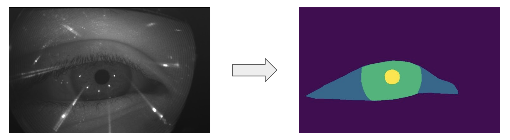

# 1st Place Solution for Facebook's OpenEDS 2020 Sparse Semantic Segmentation Challenge

- Authors: [Almaz Zinollayev](https://github.com/zeenolife), [Zhanseri Ikram](https://github.com/Zhaans)

- Video presentation for ECCV 2020: https://youtu.be/xXqDsPZyZic

- Competition: https://evalai.cloudcv.org/web/challenges/challenge-page/603/overview

## Requirements

- Linux
- Python 3.6+
- PyTorch 1.3+
- CUDA 9.2+

To install requirements:

```setup
pip install -r requirements.txt
```

## Data Preparation
First, prepare folds for training
```data_prep
python dataset/create_kfolds.py
```

## Training

To train the model, run this command:

```train
python train.py --config <path_to_config> --data-dir <path_to_data> --gpu <gpu_ids> --fold <fold_id>
```

>List of other parameters can be seen inside train.py

## Inference

To inference a model, run:

```inference
python predict_ensemble.py --data-dir <path_to_data> --label-file <path_to_file_with_sample_names> --save-dir <path_to_save> --gpu <gpu_ids>
```

> Models that should be inferenced are written in predict_ensemble.py.  
> `path_to_file_with_names` is a file with all sample names e.g. `S_0/label_0.npy` and etc.

## Evaluation

To evaluate model, run:

```eval
python validate.py --data-dir <path_to_data> --pred-dir <path_to_predictios> --fold <fold_id>
```

>Predictions from model should be inferenced beforehand

## Pre-trained Models

You can download pretrained models here:

- [UNet EfficientNet-b7](https://drive.google.com/file/d/1xcX0SZFXTER7aq48LbwV8rRG8ixp9aOy/view?usp=sharing) trained on pseudolabels.

## Results

Our models achieve the following performance on:

### [OpenEDS 2020 Sparse Semantic Segmentation Leaderboard](https://evalai.cloudcv.org/web/challenges/challenge-page/603/leaderboard/1680)

| Model                  | mIoU        |
| ---------------------- |------------ | 
| UNet EfficientNet-b7   |     95.15%  | 
| Ensemble of 10 Models  |     95.17%  |
> The reason why the ensemble gives such a small accuracy increase is that most of the models in the ensemble were trained sub-optimally, as we've found out best training pipeline towards the end of the competition.


## Acknowledgement
We thank [Selim Seferbekov](https://github.com/selimsef) and [Pavel Yakubovskiy](https://github.com/qubvel) for wonderful codebase that we extensively used during competition. 

